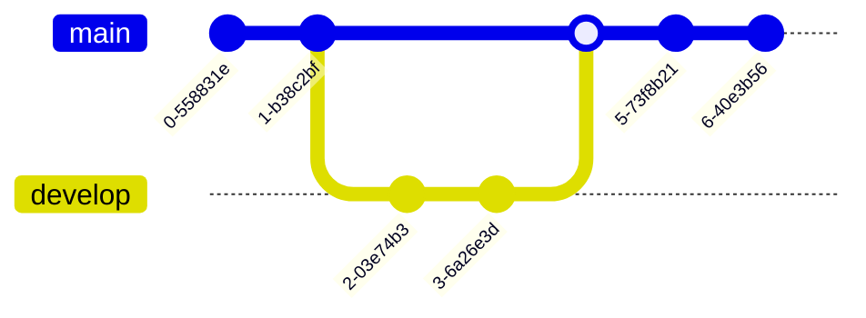

<SwmSnippet path="/docker-compose.yaml" line="1">

---

This code snippet is a configuration file written in YAML format. It defines a Docker service called "app" that is built using a Dockerfile located in the current directory. The service is set to always restart and it maps port 8000 on the host machine to port 80 inside the container.

<SwmPath>[app/](/app/)</SwmPath>

&nbsp;



```yaml
version: '3.3'

services:
  app:
    build:
      context: ./
      dockerfile: Dockerfile
    restart: always
    ports:
      - 8000:80
```

---

</SwmSnippet>

<SwmMeta version="3.0.0" repo-id="Z2l0aHViJTNBJTNBVGl0YW5pY19NYWNoaW5lX0xlYXJuaW5nX2Zyb21fRGlzYXN0ZXIlM0ElM0FBbWlyYW5Hb3phbGlzaHZpbGk=" repo-name="Titanic_Machine_Learning_from_Disaster"><sup>Powered by [Swimm](https://app.swimm.io/)</sup></SwmMeta>
